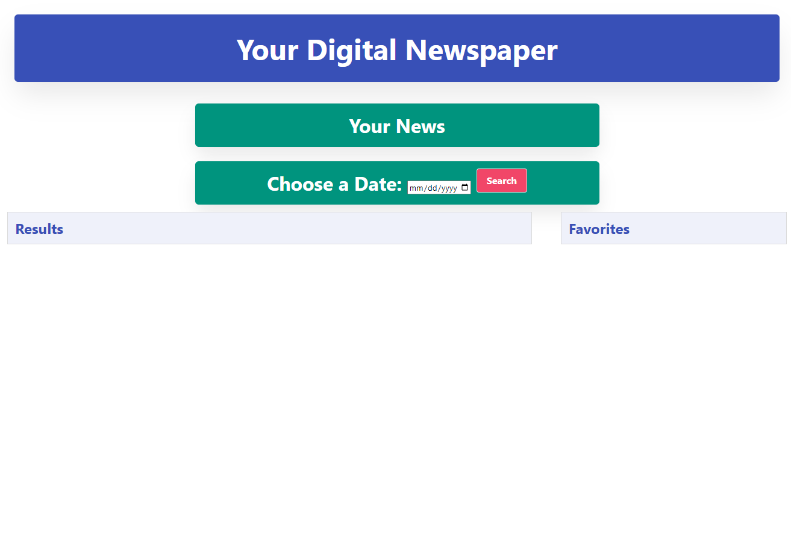
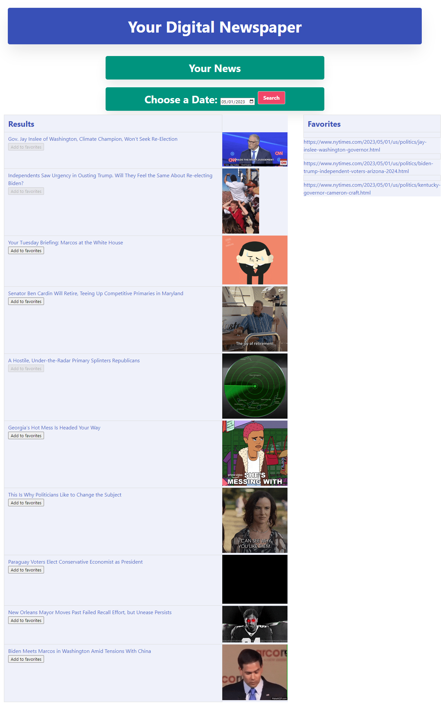

# Digital Newspaper

## User Story
* As a user, I want to be able to type in a date and have articles be presented to me from any point in time, including the present.

* When a date is entered, I want a GIF that relates to the article to be displayed on a loop, until I navigate away from the page.

* So that my learning experience can be more enjoyable and research can be more efficient in a rapidly-changing, modern news era.

## Technologies
* Bulma CSS Framework
* New York Times Articles API
* Giphy API

## Teamwork
* We decided that we wanted to work together early on due our shared opinion of not individually feeling confident in our skills. We worked together in class as a team. There were times where we were the last ones in the class and we also met outside of class via Zoom. 

## Successes & Challenges
* One of our successes and challenges was getting our Giphy API to match with the headlines of the articles. We figured this out by creating a variable that slices the characters on the headline data property and applying it to the Giphy API function. 
Our second success and challenge was figuring out how to use a new CSS framework to create a clean website. 

## Directions for Future Deployment
* Add a different API so the user can have more resources available to them.
* Add option to email links to users for ease of access and sharing options.
* Add filters for gif searches to refine the GIF searches, making them more relevant.

## Credits
* We couldn't have completed this project without the resources that we were given from the bootcamp and the knowledge that we have gained from being taught by Rommel and Ringo. We also recieved help from Rutgers bootcamps tutors and substitute TA's. 

# Screenshots of Website

